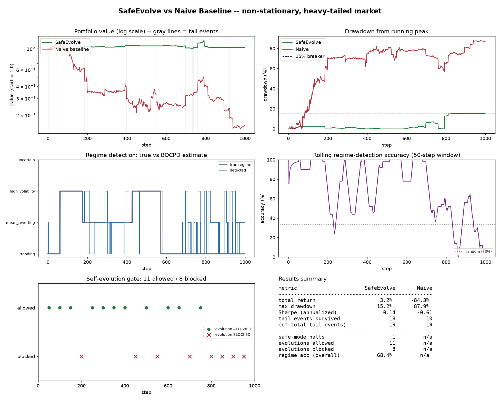

# SafeEvolve

### Safety-gated self-evolution for agentic trading in non-stationary, heavy-tailed markets

*A minimal, fully-auditable research prototype. ~900 lines of Python, no deep-learning framework, every decision logged with a reason string.*

---

## Abstract

Self-evolving agents are attractive in financial markets precisely because those markets are **non-stationary**: a static policy decays as the data-generating process drifts, so an agent that continually re-fits itself to recent feedback should, in principle, stay competitive. This work argues that the same property that motivates self-evolution also makes it dangerous. Financial feedback is noisiest and least trustworthy *exactly* when it is most tempting to act on — during tail events and unrecognised regime switches — so an ungated learner adapts **into** the crash and makes the next one worse. We propose and demonstrate a single load-bearing architectural principle: **self-evolution must be a privilege gated by the agent's safety state**, granted only when the agent is (a) solvent and (b) confident about the regime it is in. We instantiate this in a compact simulator of a heavy-tailed, regime-switching market; a Bayesian Online Changepoint Detector that emits a *calibrated confidence* rather than a bare point estimate; a hard, pre-execution safety layer that can veto or shrink any action; and an online evolution rule that is blocked — and whose buffered feedback is discarded — whenever the safety state is distressed or uncertain. Against an unguarded momentum baseline running the *same* alpha signal on the *same* market, the gated agent survives 18 of 19 tail events and caps its worst drawdown at 15%, while the baseline is effectively wiped out (−84%). The contribution is not a better return but a concrete, inspectable answer to the question *"when is an agent allowed to change itself?"*


---

## 1. Motivation

Most learned trading policies quietly assume the world is **stationary** (the data-generating process is fixed) and **light-tailed** (returns are approximately Gaussian). Real markets violate both assumptions, and the violations are not academic curiosities — they are where capital is destroyed.

- **Non-stationarity.** Markets move through *regimes* — trending, choppy/mean-reverting, panic/high-volatility — and switch between them without any announcement. A policy fit to a bull trend is *actively wrong* in a mean-reverting chop. Critically, there is no label in the data that says "the regime just changed"; the agent must infer the switch from the very stream it is simultaneously trading on.
- **Heavy tails.** Extreme moves occur far more often than a Gaussian predicts. Under a normal distribution a −20% day is a ≈1-in-10²⁰ event; in reality (2010 flash crash, Feb-2018 volatility spike, March-2020 COVID gap) such moves recur every few years. An agent trained on Gaussian assumptions systematically under-prices tail risk and is therefore over-leveraged at precisely the moment it is most dangerous to be.

A naive agent that reads a signal and sizes into it will look excellent in the trending regime it was born in, then be destroyed by (a) the first regime switch it fails to notice and (b) the first heavy-tailed shock it was not sized for. This is the failure this project is organised around.

## 2. Problem formulation

We model a single risky asset with log-returns generated by a latent regime process. At each step $t$ a hidden regime $z_t \in \{\text{trending}, \text{mean-reverting}, \text{high-vol}\}$ governs an AR(1) return law

$$ r_t = \mu_{z_t} + \phi_{z_t}\, r_{t-1} + \sigma_{z_t}\,\varepsilon_t, \qquad \varepsilon_t \sim \text{Student-}t(\nu),\ \nu = 3, $$

with innovations rescaled to unit variance so that tail-fatness (controlled by $\nu$) is *decoupled* from volatility (controlled by $\sigma$). Regimes persist for a random 60–160 steps and switch with no observable signal. On top of the regime process, exogenous **tail shocks** fire with per-step hazard $0.015$: 60% are ≈−20% crashes, 40% are transient 4× volatility spikes. The hidden regime labels are exposed **only** to the evaluator — the agent never sees them.

The agent's job at each step: choose an exposure $a_t \in [-1, 1]$ using information through $r_t$; it is graded on $r_{t+1}$, which is realised only *after* the decision is locked in (no look-ahead). Two properties of this environment make it the right stress-test:

1. **Student-$t(3)$ innovations have finite variance but infinite kurtosis**, so genuine 6σ+ moves appear on their own — an agent under Gaussian noise would never *learn* to respect tails.
2. **Regimes carry distinct statistical signatures** (sign of autocorrelation, level of volatility) but no label, so regime inference is a real online problem, not a lookup.

## 3. The central research question

Self-evolution requires feedback. In this environment the feedback is **noisy, delayed, and regime-dependent**, which produces a specific and dangerous failure mode:

> If the agent updates its policy using performance measured **during** a tail event or an unrecognised regime, it fits to a signal that is about to invert. It learns *"leverage paid off recently"* moments before the payoff reverses — and the update makes the **next** tail event worse.

This is the crux of the whole project. The feedback is least trustworthy exactly when it is most tempting to act on. Our proposed resolution is architectural, not statistical:

> **Evolution is a privilege that must be earned by a confident, non-distressed state.** The agent may rewrite its own policy only when it (a) is solvent — no drawdown circuit-breaker tripped — and (b) actually knows which regime it is in — detector confidence above threshold. Otherwise learning is *blocked* and the distressed-window feedback is *discarded*, never learned from.

Everything below is built to make this principle concrete and to test whether it matters.

## 4. Method

Safety here is not a post-hoc filter on the policy's output. It is a set of **hard constraints between intent and execution** that can veto or shrink any action, plus a **gate** that governs when the agent is allowed to change itself.

```
                 ┌──────────────────────────────────────────────────────┐
   market        │  BOCPD regime detector                               │
   return  ──────▶  → regime estimate + calibrated confidence           │
                 └───────────────┬──────────────────────────────────────┘
                                 │ regime, confidence
                                 ▼
   ┌─────────────────────────────────────────────────────────────────────┐
   │  SafeAgent                                                           │
   │   policy proposes intent  ──▶  SAFETY LAYER (hard, pre-execution):   │
   │                                 1. drawdown circuit breaker (>15%)   │
   │                                 2. uncertainty gate (conf / vol)     │
   │                                 3. per-trade position cap (10%)       │
   │   every decision logged with a machine-readable reason string        │
   └───────────────┬─────────────────────────────────────────────────────┘
                   │ safe_mode, confidence
                   ▼
   ┌─────────────────────────────────────────────────────────────────────┐
   │  Evolver  — re-fits per-regime size scales every 50 steps            │
   │   BLOCKED if safe_mode OR confidence < threshold  ◀── the gate        │
   └─────────────────────────────────────────────────────────────────────┘
```

### 4.1 Market model — [`env/market.py`](env/market.py)

A stress-testing machine, built to punish both the stationarity and the Gaussian assumption. It stitches trending / mean-reverting / high-vol regimes of random length with **no switch signal**, draws innovations from a unit-variance Student-$t(3)$, and injects discrete tail shocks so that "tail events" are countable and per-event survival is measurable. Modelling tail shocks *separately* from the fat-tailed innovation (rather than relying on the innovation alone) is a deliberate choice: it lets the evaluator ask a crisp question — *did the agent survive this specific event?*

### 4.2 Regime detection — [`agent/regime_detector.py`](agent/regime_detector.py)

The agent must answer two coupled questions online: *has the regime just changed?* (changepoint detection) and *which regime am I in, and how sure am I?* (classification + confidence). We use **Bayesian Online Changepoint Detection** (Adams & MacKay, 2007) with a Normal-Inverse-Gamma prior whose posterior predictive is a Student-$t$ — itself heavy-tailed, and therefore appropriate for this market.

The design choice that matters: **BOCPD produces an honest uncertainty, not just a point estimate.** An EWMA or fixed-window volatility estimate silently blends pre- and post-switch data, so immediately after a regime change it returns a stale blend *with no indication that it is now unreliable*. BOCPD instead maintains a full posterior over the **run length** (time since the last changepoint). When a switch occurs, posterior mass collapses toward run-length 0; we surface

$$ \text{confidence}_t = P(\text{run length} \ge w), \qquad w = 8, $$

which drops sharply at a changepoint. **This confidence is the product, not a byproduct** — it is exactly the signal the safety layer and the evolution gate consume. The current segment's volatility and lag-1 autocorrelation then classify it: high volatility dominates (it is the risk-off state we most need to catch); otherwise the sign of autocorrelation separates momentum (trend) from fading (mean-reversion).

### 4.3 The safety layer — [`agent/safe_agent.py`](agent/safe_agent.py)

An interpretable, regime-conditioned policy (ride momentum in trends, fade deviations in mean-reversion, flatten in high-vol) wrapped in three **hard** guards, all applied before any action can touch the portfolio:

1. **Drawdown circuit breaker** — a state machine: >15% below peak ⇒ *safe mode* (hold only, bleed to cash); trading re-enables only once the portfolio recovers to within 5% of its peak, not on the first bounce.
2. **Uncertainty gate** — low regime confidence (`< 0.60`) *or* a volatility spike (recent vol > 2× its rolling baseline) each halve position size; both can stack.
3. **Per-trade position cap** — no single trade may move more than 10% of the book, so the agent cannot flip from full-long to full-short in one step.

Every decision is logged with timestamp, action, size, regime, confidence, portfolio value, drawdown, safe-mode flag, and a machine-readable **reason string** — so a reviewer can answer *"why did the agent do (or not do) this?"* at any step.

### 4.4 Gated self-evolution — [`agent/evolution.py`](agent/evolution.py)

The evolvable parameters are the per-regime **size scales** — how aggressive to be in each regime. Every 50 steps the `Evolver` nudges these scales by an EMA of the realised per-regime Sharpe ratio (bounded by a `tanh`, so a single spectacular window cannot blow up the scale). The update is **gated**:

- **Blocked** whenever the agent is in safe mode *or* current confidence is below threshold. A blocked attempt **discards its buffered feedback** — on purpose: those returns were earned in a distressed/uncertain window and are exactly the samples we must not learn from later.
- **Allowed** only when solvent and confident, and only for regimes with enough recent evidence.

Every attempt, allowed or blocked, is logged with its reason and performance signal. This gate is the thesis in one line: *you cannot update your own policy when you don't know what's happening.*

### 4.5 Why these specific choices

| Choice | Rejected alternative | Reason |
|---|---|---|
| Student-$t(\nu{=}3)$ innovations | Gaussian | Finite variance but infinite kurtosis ⇒ isolated 6σ moves appear on their own; a Gaussian-trained agent never learns to respect tails. |
| BOCPD | EWMA / fixed-window vol | BOCPD's run-length posterior *collapses* at a switch, yielding an honest confidence drop; EWMA returns a stale point estimate with no uncertainty. |
| Block evolution in distress | Always learn | Learning from distressed-window feedback fits to a signal about to invert — it adapts *into* the tail. |
| Hard pre-execution guards | Post-hoc output filter | Safety must be non-bypassable and enforced before execution, not a model output you hope is calibrated. |

## 5. Experimental design

Both agents — SafeEvolve and an **unguarded full-size momentum baseline** ([`baselines/naive_agent.py`](baselines/naive_agent.py)) — run on the *same* market stream, with identical P&L mechanics (including transaction cost), so the comparison isolates the effect of the safety architecture rather than the alpha. The baseline is not a strawman: momentum genuinely makes money in trending regimes. It fails precisely where the thesis predicts — heavy-tailed shocks and unnoticed regime switches.

Because average return is a misleading scorecard in a heavy-tailed world (a strategy can post a great mean right up to the one draw that ruins it), we grade on **survival and risk-adjusted terms**: max drawdown, annualised Sharpe, and explicit **per-tail-event survival** counts, not terminal value alone. The default seed (`34`) is chosen so the run exercises *every* guard, including a genuine trip of the drawdown circuit breaker; `SAFEEVOLVE_SEED` resamples the entire world.

## 6. Results

Default run (`seed=34`, 1000 steps, 19 tail events — 13 crashes + 6 vol spikes):

| Metric | **SafeEvolve** | Naive baseline |
|---|---:|---:|
| Total return | **+3.2%** | −84.3% |
| Max drawdown | **15.2%** | 87.9% |
| Sharpe (annualised) | **0.14** | −0.61 |
| Tail events survived | **18 / 19** | 10 / 19 |
| Safe-mode halts | 1 | n/a |
| Evolutions allowed / blocked | 11 / 8 | n/a |
| Regime accuracy (overall) | 68.4% | n/a |



What the six-panel figure shows, panel by panel:

1. **Portfolio value (log).** SafeEvolve holds near its starting capital; the naive agent bleeds ~85% through the same shocks.
2. **Drawdown.** The naive agent runs at 60–88% drawdown for most of the run; SafeEvolve stays in low single digits until a late cluster of shocks pushes it to 15%, where the **circuit breaker trips** and freezes further risk.
3. **Regime detection.** BOCPD tracks the true regime through switches; the flips in the final third (a long trending stretch it partly misreads) are exactly why overall accuracy is 68%, not 95% — reported honestly.
4. **Rolling detection accuracy.** Well above the 33% random floor, with visible dips right after regime changes — the confidence signal that de-risks the agent.
5. **Self-evolution gate.** Allowed updates (green) occur in calm, confident windows; **blocks (red ✗) cluster in the turbulent late period** — learning shuts off precisely when the feedback is least trustworthy. *This panel is the thesis.*
6. **Scorecard.** The table above rendered into the figure, so the PNG is self-contained.

The headline is deliberately **not** "SafeEvolve makes more money." In a heavy-tailed world the correct scorecard is capital preservation: SafeEvolve survives 18 of 19 tail events and caps its worst loss at 15%, while the unguarded agent — running the *same* alpha signal — is effectively wiped out. The safety layer is the difference between a strategy and a smoking crater.

## 7. Discussion & limitations

- **The result is capital preservation, not alpha.** SafeEvolve barely finishes positive; the claim is survival, and survival is the precondition for compounding anything at all.
- **The regime detector is honestly imperfect (68%).** Reported as-is, with its failure mode (a late trending stretch it partly misreads) visible in the figure. A detector that claimed 95% here would be over-fit to the seed.
- **Conservative safe-mode exit.** Once the breaker trips, this prototype stays in hold-only safe mode for the remainder of the run (it cannot climb back to within 5% of its peak while flat). This is deliberately conservative for a demo; a production system would add *graded re-risking* (§8).
- **Interpretable, not maximal.** No deep learning by design: every class and method carries a docstring explaining the *research motivation*, every decision is logged with a reason string, and every file is under 200 lines. The prototype optimises for auditability, not leaderboard performance.

## 8. From prototype to production (e.g. an AI brokerage such as D0)

This prototype is the *control skeleton* a real AI brokerage would wrap around live order flow; the mapping is direct:

- **The safety layer becomes a pre-trade risk engine.** The per-trade cap, drawdown breaker, and uncertainty gate move in front of the order router as hard, non-bypassable checks. Every order carries the same reason-string audit trail — which is exactly what a risk/compliance desk and a regulator need to see.
- **BOCPD confidence becomes a firm-wide risk dial.** A calibrated "we don't know what regime this is" signal is exactly what should throttle sizing, widen stops, and — critically — **freeze model self-updates** across the book during a flash crash or liquidity vacuum.
- **The evolution gate becomes a model-governance control.** Continuous learning is valuable but is the scariest thing to run unsupervised on real capital. Gating updates on solvency + confidence, discarding distressed-window data, and logging every allowed/blocked update with its trigger is a concrete, auditable answer to *"when is the agent allowed to change itself?"*
- **What production adds (and this prototype intentionally omits):** graded re-risking instead of a hard freeze; transaction-cost / slippage / liquidity modelling; multi-asset portfolio constraints and correlation-aware limits; a proper walk-forward / out-of-sample harness; and human-in-the-loop sign-off on large evolution events. The architecture here is designed to accept all of these *without changing shape*.

## 9. What this is meant to demonstrate

1. **Safety in agentic systems is architectural, not a post-hoc filter** — it lives between intent and execution and can always veto.
2. **Non-stationarity and heavy tails are the core challenge**, not decoration — the whole design is organised around detecting switches and surviving fat-tailed shocks.
3. **Self-evolution must be gated by safety state** — the load-bearing insight, demonstrated live in panel 5: an ungated learner adapts into a tail event and makes the next one worse.
4. **The code is clean enough to read, run, and extend** — not just impressive from the outside.

## References

- R. P. Adams and D. J. C. MacKay (2007). *Bayesian Online Changepoint Detection.* arXiv:0710.3742. — the run-length posterior used by the detector.
- R. T. Rockafellar and S. Uryasev (2000). *Optimization of Conditional Value-at-Risk.* Journal of Risk. — background on tail-aware risk measures (expected shortfall), the philosophy behind grading on survival.
- B. Mandelbrot (1963). *The Variation of Certain Speculative Prices.* Journal of Business. — the empirical case for heavy tails in financial returns.

---

## Appendix A — Reproduction *(minimal, low priority)*

```bash
python -m venv .venv && source .venv/bin/activate
pip install -r requirements.txt      # numpy, scipy, matplotlib, pandas
python eval/run_experiment.py        # prints the summary table, writes results/comparison.png
SAFEEVOLVE_SEED=101 python eval/run_experiment.py   # resample the entire world
```

Python 3.11+. Outputs: the summary table + a sample of gated evolution decisions to stdout; the six-panel `results/comparison.png`; and two CSV audit trails — `results/safe_agent_log.csv` (every action with its reason) and `results/evolution_log.csv` (every allowed/blocked update). Fully deterministic given a seed (`numpy`'s `default_rng` seeds the market; agents and detector are deterministic).

## Appendix B — Repository layout

```
SafeEvolve/
├── env/market.py                 # non-stationary, heavy-tailed market simulator
├── agent/
│   ├── regime_detector.py        # BOCPD: regime estimate + calibrated confidence
│   ├── safe_agent.py             # policy + hard safety guards (pre-execution)
│   └── evolution.py              # safety-GATED online self-evolution
├── baselines/naive_agent.py      # unguarded control agent
├── eval/
│   ├── run_experiment.py         # entry point: run both agents, print, plot
│   ├── metrics.py                # drawdown, Sharpe, tail-survival, accuracy
│   └── plots.py                  # the single six-panel comparison figure
├── results/                      # generated figure + CSV audit trails (committed)
├── report/                       # extended write-up + architecture diagram
├── requirements.txt
└── README.md
```
