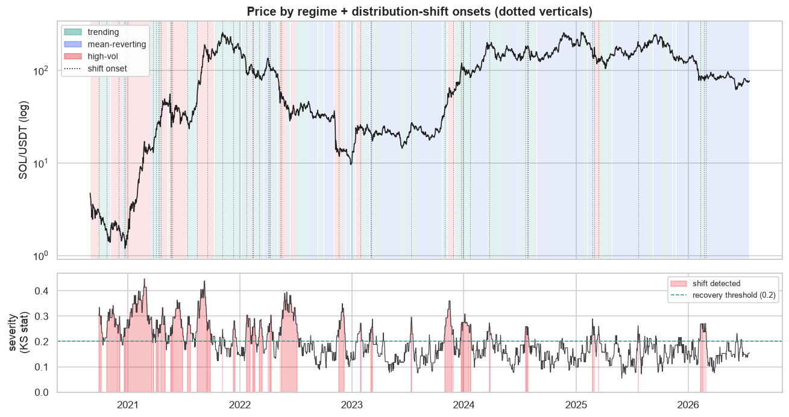
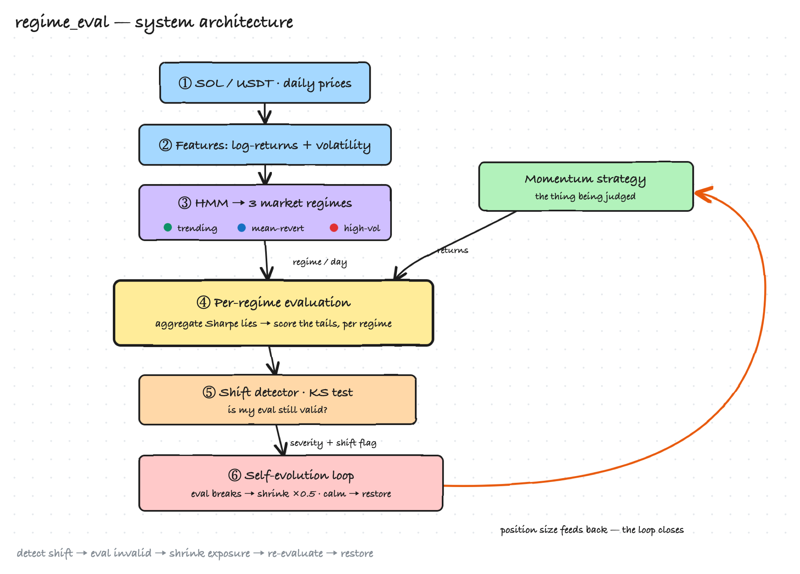
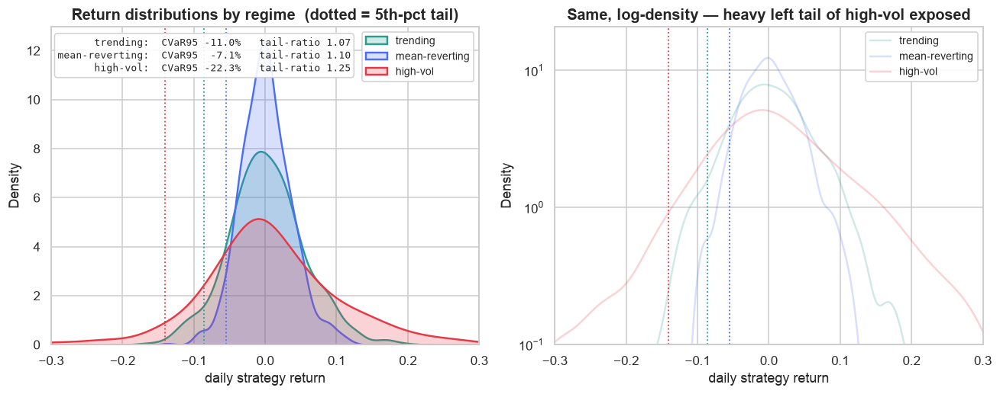
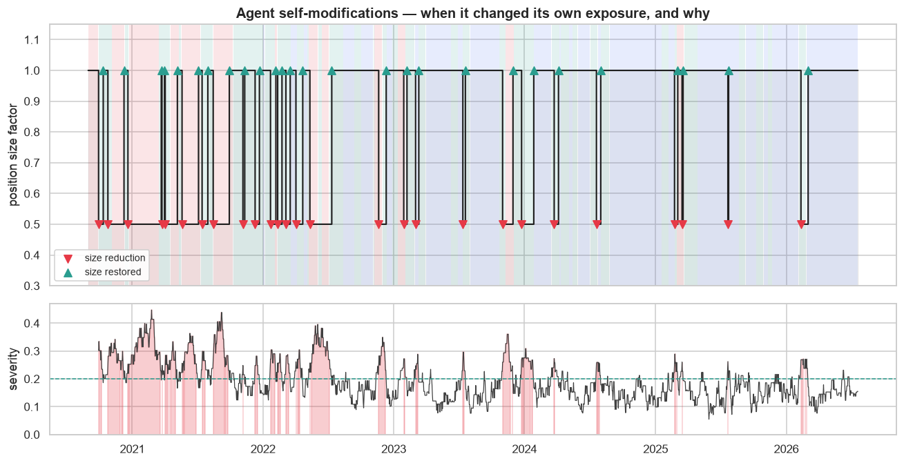

# Regime-Aware Evaluation for a Trading Agent

### When is a backtest number valid, and can an agent tell when its own evaluation has gone stale?

*A small, self-contained research harness on real SOL/USDT history. Typed, docstringed, importable modules; a single notebook as the demo surface; no network or API keys required after the first fetch.*

---

## Abstract

A single backtest number — a Sharpe ratio over the whole sample — implicitly assumes one stationary, roughly-Gaussian return distribution. In real crypto markets that assumption is false, and the number it produces is therefore not merely *noisy* but **invalid**: it averages together statistically distinct regimes and hides the tail that will actually end the strategy. This harness makes that failure legible and then closes a loop around it. We (1) segment SOL/USDT history into `trending`, `mean-reverting`, and `high-vol` regimes with a Gaussian HMM whose labels are recovered *from the data* and independently cross-checked by PELT change-point detection; (2) evaluate the same momentum strategy **inside each regime** with tail-aware metrics (CVaR / expected shortfall, drawdown as a rolling distribution, tail ratio), never aggregating; (3) monitor a rolling Kolmogorov–Smirnov distribution-shift test as an *"is my evaluation still valid?"* sensor; and (4) let the agent self-evolve — shrinking its own exposure when the shift fires and restoring it when the distribution returns in-bounds. The central empirical finding is that the aggregate Sharpe (+0.63) hides a **2.4× spread** across regimes and, worse, *crowns the most dangerous regime as the best*. Against the honest control — uniform deleveraging at the same average exposure — the shift-driven agent achieves a smaller tail loss (CVaR) and shallower drawdown, i.e. it earns its keep by cutting risk *exactly where the evaluation is invalid* rather than everywhere blindly.



> **Reading guide.** This document is written as a research report; §1–§7 are the argument. Reproduction is a short appendix (§A) — the point is the *method*, not the run button. An extended write-up lives in [`Regime-Aware-Evaluation-Report.docx`](Regime-Aware-Evaluation-Report.docx).

---

## 1. The thesis

> **In non-stationary, heavy-tailed markets a single backtest number is not just noisy — it is invalid. An agent that knows *when its own evaluation has gone stale* is safer than one that just optimises harder.**

This is the tension a real agentic brokerage lives inside: *"making numbers that make sense AND making numbers higher"* — evaluation validity and optimisation, held at the same time while the distribution keeps shifting. The whole harness exists to make that tension concrete and measurable.



## 2. Why one Sharpe number is invalid, not just noisy

A backtest statistic is an estimator, and every estimator carries assumptions about the distribution it summarises. Sharpe assumes i.i.d., approximately-Gaussian, stationary returns. Crypto returns violate all three:

- **Non-stationary.** The series is a concatenation of regimes with different means, volatilities, and autocorrelation structures. A statistic computed over the union describes *no* regime.
- **Heavy-tailed.** The worst 5% of days dominate realised risk; a variance-based measure like Sharpe is nearly blind to them.
- **Regime-dependent tails.** The tail is not uniform — it is concentrated in one regime. Averaging spreads that concentrated risk across the whole record and makes it disappear from the summary.

The consequence is not a wider confidence interval; it is a number that points the wrong way. §4 shows it literally ranking the most dangerous regime as the best.

## 3. Method — the argument in five steps

The engine is a set of typed, importable modules under [`regime_eval/`](.); the demo surface is [`notebooks/main.ipynb`](notebooks/main.ipynb), which runs top-to-bottom against a cached CSV.

### Step 1 — Segment the market into regimes ([`models/regime.py`](models/regime.py))

A 3-state `GaussianHMM` is fit on `[log_return, realized_vol_20d]`. Regimes are **auto-labelled from their own statistics** — there is *no* hardcoded `state → name` map, because the HMM assigns arbitrary integer ids on every fit. The heuristic: the highest-mean-volatility state is `high-vol`; of the two calmer states, the one with larger absolute mean return is `trending`; the remaining flat state is `mean-reverting`. This makes labelling robust to re-seeding and re-fitting.

The segmentation is then **independently cross-checked** with PELT change-point detection (`ruptures`, RBF cost), which knows nothing about the HMM. Agreement between two unrelated methods is evidence the regimes are real structure, not a modelling artefact: **≈72% of HMM regime transitions land within 7 days of a PELT breakpoint.**

### Step 2 — Evaluate per regime, never aggregate ([`eval/metrics.py`](eval/metrics.py))

The same momentum strategy is scored *inside each regime*. This table is the whole point:

| regime | Sharpe *(ref only)* | CVaR&nbsp;95 | max drawdown | tail ratio |
|---|---:|---:|---:|---:|
| trending | +0.63 | −11.0% | −81% | 1.07 |
| mean-reverting | +0.41 | −7.1% | −71% | 1.10 |
| **high-vol** | **+0.98** | **−22.3%** | **−90%** | 1.25 |
| *ALL (aggregate)* | *+0.63* | *−12.9%* | *−85%* | *1.14* |

The aggregate Sharpe (+0.63) hides a **2.4× spread** across regimes. Worse: **Sharpe crowns `high-vol` the *best* regime (+0.98)** while its CVaR is **3.1× the tail loss** of the calm regime. *An optimiser maximising Sharpe would lever straight into the regime most likely to blow it up.* That is "numbers higher" fighting "numbers that make sense."

### Step 3 — Measure the tails, not the average ([`eval/metrics.py`](eval/metrics.py))

Sharpe assumes thin tails; these are not thin. We use:

- **CVaR / expected shortfall** — the *mean* loss inside the worst 5%. Unlike VaR (a single quantile) it looks *past* the threshold into the tail's shape, which is where heavy tails hide.
- **Max drawdown as a rolling *distribution*** — not one summary number, so the heavy tail stays visible instead of being averaged away.
- **Tail ratio** — upside tail ÷ downside tail; `<1` means losses tail harder than gains.

Sharpe is retained *everywhere* only as an explicitly-labelled reference — the number kept in frame so the reader can watch it lie — never as a decision variable.

### Step 4 — Detect distribution shift: *"is my eval still valid?"* ([`eval/shift.py`](eval/shift.py))

A rolling 30-day two-sample Kolmogorov–Smirnov test (`scipy.stats.ks_2samp`) compares recent returns to a **reference regime**. The reference is chosen as the *thinnest-tailed, most benign* regime — the one with the least-negative CVaR — because a backtest's numbers only mean what they claim under roughly-stationary, thin-tailed returns. (Anchoring to the best-*Sharpe* regime would be perverse: `high-vol` posts the highest Sharpe precisely because it carries the worst tail, so the sensor would fire during calm markets.) KS is used over KL divergence because it is non-parametric (no density estimation or binning), its statistic is already normalised to `[0, 1]` — a ready-made **severity** score — and it ships with a calibrated p-value. The shift *fires* when $p < 0.05$.

### Step 5 — Close the loop with self-evolution ([`evolution/self_evolve.py`](evolution/self_evolve.py))

When a shift fires the agent shrinks its own exposure by `SHRINK_FACTOR`; when severity falls back below `RECOVERY_THRESHOLD` it restores it. Every self-modification is logged in a structured, auditable record.

> **detect shift → eval is now invalid → reduce exposure → re-evaluate → restore when back in-distribution**

This is deliberately a *stub* — a single legible control law. The contribution is the *shape* of the loop (an agent reacting to the invalidation of its own evaluation), not a production risk model.

## 4. The four notebook outputs

| # | Output | What it shows |
|---|---|---|
| 1 | **Price timeline coloured by regime + shift markers** | where each regime lives, and when the eval went stale ([above](#regime-aware-evaluation-for-a-trading-agent)) |
| 2 | **Per-regime performance table** (styled) | the divergence the aggregate number hides |
| 3 | **Overlaid return distributions with tail annotations** | the heavy left tail of `high-vol`, exposed on a log-density axis |
| 4 | **Self-modification event timeline** | when the agent changed its own behaviour, and why |

<p align="center">
  
  
</p>

## 5. Results — did the safety loop help, or did it just deleverage?

The honest test is not "adaptive vs. do-nothing" — any deleveraging cuts tail risk. It is **adaptive vs. uniform deleveraging at the same average exposure (0.86×)**, which controls for the amount of risk removed and isolates whether removing it *at the right times* matters:

| strategy | Sharpe *(ref)* | CVaR 95 | max drawdown | terminal wealth |
|---|---:|---:|---:|---:|
| baseline (1.00×) | +0.64 | −12.9% | −85% | 73.3× |
| uniform (0.86×) | +0.64 | −11.1% | −81% | 40.2× |
| **adaptive (safety loop)** | +0.63 | **−10.4%** | **−77%** | 31.9× |

At **equal average exposure**, the targeted agent posts a smaller CVaR and a shallower drawdown than blunt deleveraging — the shift detector *earns its keep* by cutting risk exactly where the evaluation is invalid. The loop is **not free**: it gives up compounded upside (lower terminal wealth). But it buys tail safety at **no cost to risk-adjusted return (Sharpe)** and more efficiently than deleveraging blindly. This is the quantitative statement of "numbers that make sense" and "numbers higher" being held at once.

## 6. Discussion & honest caveats

- **Regime labels are a descriptive overlay, not a tradeable signal.** The HMM is fit on the full sample, so a regime label at time $t$ uses information from the whole sequence and is not known causally at $t$. That is acceptable here — regimes are used to *evaluate* validity, not to trade. The momentum strategy itself is strictly causal (positions lag the signal by one day).
- **Self-evolution is a stub, deliberately.** The response is one control law (halve size, restore on recovery). The point is the *shape* of the loop, not a production risk model.
- **`high-vol` posts the highest mean return *and* the highest variance.** That is not a bug; it is the seed of the whole problem. Crypto's largest single-day moves cluster in the high-vol regime, which is exactly why a tail-blind metric (Sharpe) rates it best and a tail-aware one (CVaR) rates it worst.
- **Single asset, single strategy, one history.** The claim is methodological — *how to evaluate* — not that momentum on SOL is a good strategy. The harness is built to swap in either.


## References

- L. Baum et al. (1970); *Hidden Markov Models* — the HMM machinery behind the regime segmentation.
- R. Killick, P. Fearnhead, I. Eckley (2012). *Optimal Detection of Changepoints with a Linear Computational Cost (PELT).* JASA. — the independent change-point cross-check.
- R. T. Rockafellar and S. Uryasev (2000). *Optimization of Conditional Value-at-Risk.* Journal of Risk. — CVaR / expected shortfall.
- F. J. Massey (1951). *The Kolmogorov–Smirnov Test for Goodness of Fit.* JASA. — the two-sample distribution-shift test.

---

## Appendix A — Reproduction *(minimal, low priority)*

```bash
cd regime_eval
python -m venv .venv && source .venv/bin/activate
pip install -r requirements.txt

# run the demo end-to-end (headless)
jupyter nbconvert --to notebook --execute --inplace notebooks/main.ipynb
# ...or open it interactively
jupyter lab notebooks/main.ipynb
```

The first run fetches SOL/USDT daily OHLCV from Binance (via `ccxt`) and caches it to `data/cache/`. Every subsequent run — including the notebook — reads the CSV and needs **no network**. The engine is also importable directly:

```python
from regime_eval.data import load_price_data
from regime_eval.models import RegimeDetector
from regime_eval.strategy import strategy_returns
from regime_eval.eval import per_regime_metrics, run_shift_detection
from regime_eval.evolution import run_self_evolution

prices  = load_price_data()
regimes = RegimeDetector().fit(prices).regime_series()
```

## Appendix B — Configuration & layout

Every tunable lives in [`config.py`](config.py) (paths derived from `__file__`, none hardcoded):

| name | default | meaning |
|---|---|---|
| `SYMBOL` / `TIMEFRAME` | `SOL/USDT` / `1d` | market + candle timeframe |
| `HMM_STATES` | `3` | number of regimes |
| `MOMENTUM_WINDOW` | `20` | momentum lookback (periods) |
| `SHIFT_DETECTION_WINDOW` | `30` | rolling window for the KS test |
| `SHIFT_ALPHA` | `0.05` | KS p-value threshold to fire a shift |
| `SHRINK_FACTOR` | `0.5` | size multiplier when a shift fires |
| `RECOVERY_THRESHOLD` | `0.2` | severity below which size is restored |
| `CVAR_LEVEL` | `0.95` | confidence level for CVaR / expected shortfall |

```
regime_eval/
├── config.py            # every tunable in one place; paths derived, none hardcoded
├── data/fetch.py        # price fetching + CSV caching (ccxt → CryptoCompare fallback)
├── models/regime.py     # GaussianHMM regime detector + auto-labelling + PELT cross-check
├── strategy/momentum.py # baseline momentum strategy (causal, 1-day lag)
├── eval/
│   ├── metrics.py       # per-regime heavy-tail metrics (CVaR, rolling drawdown, tail ratio)
│   └── shift.py         # rolling KS distribution-shift detector
├── evolution/self_evolve.py  # the safety loop + structured event log
├── notebooks/main.ipynb # the demo surface — runs top to bottom
├── assets/              # generated figures + architecture diagram
└── README.md
```
