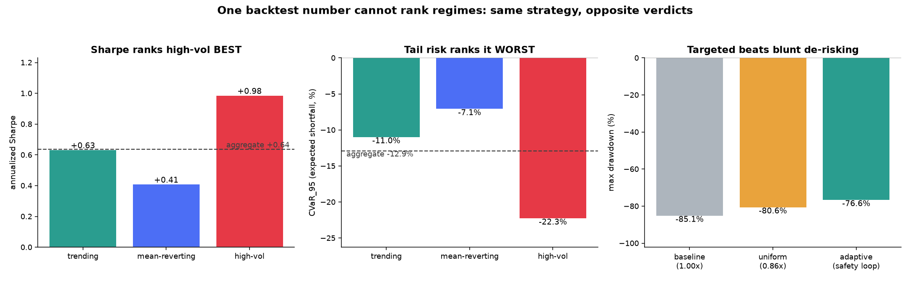

# regime_eval

A backtest harness that splits 2,170 daily SOL/USDT candles (Aug 2020 to Jul 2026) into three market regimes and scores the same momentum strategy separately inside each one.
The claim: a single aggregate Sharpe ratio does not merely lose detail, it inverts the ranking — it names the regime with the worst tail risk as the best regime.
Second claim: an agent that cuts its position size when a distribution-shift test fires ends up with a smaller tail loss than uniform deleveraging at the same average exposure.

## Result

Same strategy, same 2,150 trading days, scored two ways. The last row is the naive single-number view; the rows above it are the same days split by regime.

| Regime | Days | Sharpe (annualized) | CVaR 95% | Max drawdown | Tail ratio |
| --- | ---: | ---: | ---: | ---: | ---: |
| trending | 800 | +0.63 | -10.98% | -81.32% | 1.07 |
| mean-reverting | 930 | +0.41 | -7.08% | -70.94% | 1.10 |
| high-vol | 420 | **+0.98** | **-22.26%** | -90.08% | 1.25 |
| All days (aggregate) | 2,150 | +0.64 | -12.91% | -85.13% | 1.14 |

Sharpe ranks high-vol as the best of the three regimes (+0.98) while its expected shortfall is 3.1x that of the calm regime (-22.26% against -7.08%), so a system tuned to maximize Sharpe would allocate hardest into the regime with the worst tail. The aggregate row sits near the trending regime and describes none of the three: it hides a 2.4x Sharpe spread (+0.41 to +0.98) and reports a tail loss that is too small for high-vol and too large for mean-reverting.



## Reproduce

From a fresh clone. All commands are run from the repository root.

Linux / macOS:

```bash
git clone <repo-url> Donut
cd Donut
python3 -m venv .venv
source .venv/bin/activate
pip install -r regime_eval/requirements.txt
python -m regime_eval.run_report
```

Windows PowerShell:

```powershell
git clone <repo-url> Donut
cd Donut
python -m venv .venv
.\.venv\Scripts\Activate.ps1
pip install -r regime_eval/requirements.txt
python -m regime_eval.run_report
```

The only differences are `python3` vs `python` for creating the virtual environment and the activation script path. The run took 2.5 to 3.2 seconds on the machine it was tested on, prints every number in the table above, and overwrites `result.png` — byte-identically, since the pipeline is seeded.

The price data is committed at `data/cache/SOL_USDT_1d.csv`, so the run needs no network access and no API keys. Deleting that file makes `load_price_data()` refetch from Binance via `ccxt`, which will produce a longer sample and therefore different numbers.

The same pipeline as an annotated notebook:

```bash
pip install -r regime_eval/requirements.txt
jupyter lab regime_eval/notebooks/main.ipynb
```

## How it works

- Regimes come from a 3-state `GaussianHMM` (`models/regime.py`) fit on `[log_return, realized_vol_20d]`, standardized first so the Gaussian emissions see comparable scales.
- The HMM emits arbitrary integer state ids, so labels are recovered from each state's own statistics: highest mean volatility is `high-vol`, then of the two calmer states the one with larger absolute drift is `trending` and the flat one is `mean-reverting`. There is no fixed state-to-name map, so refitting cannot silently swap the labels.
- The regime boundaries get an independent cross-check from PELT change-point detection with an RBF cost (`ruptures`), which knows nothing about the HMM. In this run 49 of 68 HMM transitions (72%) fall within 7 days of one of the 70 PELT breakpoints.
- The strategy (`strategy/momentum.py`) is a 20-day momentum rule, long above / short below, with positions lagged one day so the signal at the close of day *t* earns the return from *t* to *t+1*. It is deliberately simple; the object under study is the evaluation, not the alpha.
- Metrics (`eval/metrics.py`) are tail-aware: CVaR 95% is the mean return inside the worst 5%, drawdown is also available as a rolling distribution rather than one number, and tail ratio is the 95th-percentile gain over the absolute 5th-percentile loss. Sharpe is computed but labelled "ref only" throughout.
- The shift detector (`eval/shift.py`) runs a two-sample Kolmogorov-Smirnov test between a trailing 30-day window and the reference regime's returns; the reference is the regime with the least-negative CVaR (here: mean-reverting), on the argument that backtest numbers only mean what they claim under thin-tailed returns. KS rather than KL because it needs no binning or density estimate, its statistic is already scaled to [0, 1] and doubles as a severity score, and it carries a p-value. It fires on 470 of 2,150 days (22%) across 48 episodes, with mean severity 0.150 in mean-reverting, 0.201 in trending and 0.285 in high-vol.
- The self-evolution loop (`evolution/self_evolve.py`) is a two-state control law: on a fire, halve size; once severity falls back under 0.2, restore it. This run logged 54 self-modifications (27 reductions, 27 restorations) as JSON lines with timestamp, trigger severity, regime and the new size factor.
- The right panel of the figure is the control for that loop. Average adaptive exposure over the sample is 0.86x, so the comparison is against a constant 0.86x — and constant scaling cannot move Sharpe or tail ratio at all, which is why those two columns are identical for baseline and uniform. Targeting the de-risking gives a max drawdown 3.95 points shallower (-76.63% against -80.58%) and a CVaR 0.74 points smaller (-10.37% against -11.11%), at a cost: terminal wealth falls from 40.2x to 31.9x.

## Why this matters for a constrained-autonomy stack

Donut's D0 stack ends with Closed-Loop Evolution: "verified outcomes feed replay, evaluation, policy tuning, release gates, and personalization updates." That sentence puts evaluation on the critical path — a release gate is only as trustworthy as the number it gates on, and a policy-tuning loop inherits whatever the evaluation gets wrong. This harness attacks that number directly. If a gate reads an aggregate Sharpe over a mixed sample, then on this data it would have promoted a policy on the strength of a regime whose expected shortfall is three times the calm regime's, because the metric ranked that regime first. The per-regime table is the shape a gate would need instead: one row per regime, tail metrics rather than variance-based ones, and no aggregation step in which a 2.4x spread can disappear. The shift detector adds the other half — a running check on whether the distribution the gate's evidence was collected under still holds, so that "this policy passed evaluation" can expire rather than stand indefinitely.

## Limitations

- The HMM is fit on the full sample and the reference regime is selected using the full sample, so regime labels and the shift detector's reference distribution both use information from after the day being labelled. The momentum backtest is causal, but the adaptive sizing series is not walk-forward, and a live system could not reproduce these labels in real time. This is the single largest caveat and it is not corrected for anywhere in the code.
- The rolling KS test is computed on overlapping 30-day windows, so the p-values are strongly dependent across adjacent days. The 22% firing rate is not a calibrated false-positive rate, and the 0.05 threshold does not mean 5% of fires are spurious.
- The strategy itself is not viable at these settings: max drawdown is 81-90% in every regime, and 85% in aggregate. It compounds to 73.3x over the window against 16.4x for buy-and-hold, but with a drawdown profile no risk desk would fund. The harness measures how to evaluate a strategy, and the numbers should not be read as evidence that this strategy works.
- One asset, one strategy, one timeframe, and the regime count is fixed at 3 by configuration rather than selected. Across six HMM seeds the fit was near-identical and high-vol had the best Sharpe and worst CVaR in 6 of 6, but that tests seed stability, not whether three states is the right number or whether the result transfers to another asset.
